# spring-core-performance
Comparison between 
- blocking tomcat
- reactive netty

with and without
- virtual threads (Project Loom)
- GraalVM native compilation
- profile guided optimizations

with and without integrations 
- postgresql
- mongodb
- redis
- http server

## Requirements to build test apps
- docker

## HW & SW specs
Results provided here were executed in this machine:
```
CPU: Intel(R) Core(TM) i7-7700K CPU @ 4.20GHz
RAM: 16GB DDR4 @ 3200MHz
```
```
Linux 6.2.0-35-generic #35~22.04.1-Ubuntu SMP PREEMPT_DYNAMIC Fri Oct  6 10:23:26 UTC 2 x86_64 x86_64 x86_64 GNU/Linux
Docker version 24.0.6, build ed223bc
```

## Building test apps

``` bash
bash docker_build_all.sh
```

Something went wrong? you may need to:
``` bash
sudo chmod -R 777 outputs/
```

After completition you should be able to see test apps docker images

``` bash
docker image ls --format "table {{.Repository}}\t{{.Tag}}\t{{.Size}}"
```
```
REPOSITORY        TAG           SIZE
REPOSITORY              TAG            SIZE
wfx-redis               jvm            235MB
wfx-redis               gvm-pgo        112MB
wfx-redis               gvm            140MB
wfx-r2dbc               jvm            232MB
wfx-r2dbc               gvm-pgo        105MB
wfx-r2dbc               gvm            124MB
wfx-mongo               jvm            235MB
wfx-mongo               gvm-pgo        108MB
wfx-mongo               gvm            128MB
wfx-http                jvm            228MB
wfx-http                gvm-pgo        96MB
wfx-http                gvm            115MB
wfx                     jvm            228MB
wfx                     gvm-pgo        92.1MB
wfx                     gvm            112MB
web-redis               jvm            236MB
web-redis               gvm-pgo        116MB
web-redis               gvm            146MB
web-mongo               jvm            232MB
web-mongo               gvm-pgo        105MB
web-mongo               gvm            126MB
web-jdbc                jvm            230MB
web-jdbc                gvm-pgo        102MB
web-jdbc                gvm            122MB
web-http                jvm            226MB
web-http                gvm-pgo        91.4MB
web-http                gvm            109MB
web                     jvm            226MB
web                     gvm-pgo        91.6MB
web                     gvm            110MB
```

> took like 2 hours to complete... real	113m4,676s user	0m22,057s sys 0m15,584s

## Stressing test apps

``` bash
bash stress_all.sh
```
> took like 6 hours to complete... real 397m12,422s user 0m57,416s sys 0m17,045s

**IMPORTANT** to reduce disk usage at the end will execute a 
```
docker volume prune -f
```

## Loading results
``` bash
cd apps/util_result_collector
sh mvnw spring-boot:run -Dspring-boot.run.arguments=--PATH_2_LOOK=$(pwd)/../../outputs
```

At the end it will print the test results in a html syntax:

### Simple app
Requests processed per second in 60s with a ramp up of 15s
<table>
<tr><th></th><th></th><th></th><th colspan="4">#clients & #cores</th></tr>
<tr><th></th><th></th><th></th><th colspan="2">100</th><th colspan="2">300</th></tr>
<tr><th>app</th><th>tag</th><th>thread</th><th>1</th><th>2</th><th>1</th><th>2</th></tr>
<tr><td rowspan="6">web</td><td rowspan="2">gvm</td><td>RT</td><th>31382</th><th>31370</th><th>30984</th><th>30905</th></tr>
<tr><td>VT</td><th>31469</th><th>31352</th><th>31107</th><th>30964</th></tr>
<tr><td rowspan="2">gvm-pgo</td><td>RT</td><th>39258</th><th>39172</th><th>37719</th><th>37701</th></tr>
<tr><td>VT</td><th>39298</th><th>39178</th><th>37532</th><th>37617</th></tr>
<tr><td rowspan="2">jvm</td><td>RT</td><th>36243</th><th>36402</th><th>35466</th><th>35581</th></tr>
<tr><td>VT</td><th>37201</th><th>35405</th><th>34782</th><th>34744</th></tr>
<tr><td rowspan="6">wfx</td><td rowspan="2">gvm</td><td>RT</td><th>34170</th><th>34120</th><th>33524</th><th>33691</th></tr>
<tr><td>VT</td><th>34233</th><th>34120</th><th>33498</th><th>33639</th></tr>
<tr><td rowspan="2">gvm-pgo</td><td>RT</td><th>46329</th><th>45953</th><th>45367</th><th>44907</th></tr>
<tr><td>VT</td><th>46407</th><th>46128</th><th>45132</th><th>44725</th></tr>
<tr><td rowspan="2">jvm</td><td>RT</td><th>38686</th><th>37996</th><th>36403</th><th>36835</th></tr>
<tr><td>VT</td><th>38310</th><th>37928</th><th>36724</th><th>36559</th></tr>
</table>

Amount of requests processed in 60s with a ramp up of 15s
<table>
<tr><th></th><th></th><th></th><th colspan="4">#clients & #cores</th></tr>
<tr><th></th><th></th><th></th><th colspan="2">100</th><th colspan="2">300</th></tr>
<tr><th>app</th><th>tag</th><th>thread</th><th>1</th><th>2</th><th>1</th><th>2</th></tr>
<tr><td rowspan="6">web</td><td rowspan="2">gvm</td><td>RT</td><th>1881753</th><th>1880720</th><th>1858484<br>e: 1</th><th>1854070</th></tr>
<tr><td>VT</td><th>1886867</th><th>1879594</th><th>1865627</th><th>1857750</th></tr>
<tr><td rowspan="2">gvm-pgo</td><td>RT</td><th>2353887</th><th>2348737</th><th>2262203</th><th>2261574</th></tr>
<tr><td>VT</td><th>2355265</th><th>2349245</th><th>2251265</th><th>2256163<br>e: 2</th></tr>
<tr><td rowspan="2">jvm</td><td>RT</td><th>2172855</th><th>2182376</th><th>2127199</th><th>2134223</th></tr>
<tr><td>VT</td><th>2230381</th><th>2122787</th><th>2086549</th><th>2083812</th></tr>
<tr><td rowspan="6">wfx</td><td rowspan="2">gvm</td><td>RT</td><th>2048607</th><th>2045623</th><th>2010842</th><th>2020901</th></tr>
<tr><td>VT</td><th>2052663</th><th>2045602</th><th>2008955</th><th>2017335</th></tr>
<tr><td rowspan="2">gvm-pgo</td><td>RT</td><th>2777758</th><th>2754972</th><th>2720944</th><th>2693785</th></tr>
<tr><td>VT</td><th>2782341</th><th>2765522</th><th>2706668</th><th>2682366</th></tr>
<tr><td rowspan="2">jvm</td><td>RT</td><th>2319287</th><th>2278321</th><th>2183625</th><th>2209275</th></tr>
<tr><td>VT</td><th>2297046</th><th>2273907</th><th>2202356</th><th>2193054</th></tr>
</table>


### PostgreSQL integrated app
Requests processed per second in 60s with a ramp up of 15s
<table>
<tr><th></th><th></th><th></th><th colspan="4">#clients & #cores</th></tr>
<tr><th></th><th></th><th></th><th colspan="2">100</th><th colspan="2">300</th></tr>
<tr><th>app</th><th>tag</th><th>thread</th><th>1</th><th>2</th><th>1</th><th>2</th></tr>
<tr><td rowspan="6">web-jdbc</td><td rowspan="2">gvm</td><td>RT</td><th>12961</th><th>13021</th><th>12880</th><th>12789</th></tr>
<tr><td>VT</td><th>13003</th><th>12995</th><th>12819</th><th>12823</th></tr>
<tr><td rowspan="2">gvm-pgo</td><td>RT</td><th>15480</th><th>15451</th><th>15210</th><th>15183</th></tr>
<tr><td>VT</td><th>15421</th><th>15374</th><th>15156</th><th>15134</th></tr>
<tr><td rowspan="2">jvm</td><td>RT</td><th>14867</th><th>14820</th><th>13991</th><th>13822</th></tr>
<tr><td>VT</td><th>14804</th><th>14835</th><th>13888</th><th>13865</th></tr>
<tr><td rowspan="6">wfx-r2dbc</td><td rowspan="2">gvm</td><td>RT</td><th>12129</th><th>12032</th><th>12117</th><th>11992</th></tr>
<tr><td>VT</td><th>12091</th><th>12066</th><th>12012</th><th>12053</th></tr>
<tr><td rowspan="2">gvm-pgo</td><td>RT</td><th>15588</th><th>15611</th><th>15590</th><th>15604</th></tr>
<tr><td>VT</td><th>15595</th><th>15618</th><th>15607</th><th>15557</th></tr>
<tr><td rowspan="2">jvm</td><td>RT</td><th>13411</th><th>13629</th><th>13687</th><th>13478</th></tr>
<tr><td>VT</td><th>13431</th><th>13671</th><th>13505</th><th>13522</th></tr>
</table>

Amount of requests processed in 60s with a ramp up of 15s
<table>
<tr><th></th><th></th><th></th><th colspan="4">#clients & #cores</th></tr>
<tr><th></th><th></th><th></th><th colspan="2">100</th><th colspan="2">300</th></tr>
<tr><th>app</th><th>tag</th><th>thread</th><th>1</th><th>2</th><th>1</th><th>2</th></tr>
<tr><td rowspan="6">web-jdbc</td><td rowspan="2">gvm</td><td>RT</td><th>777178</th><th>780829</th><th>772614</th><th>767271</th></tr>
<tr><td>VT</td><th>779595</th><th>779142</th><th>769049</th><th>769368</th></tr>
<tr><td rowspan="2">gvm-pgo</td><td>RT</td><th>928084</th><th>926481</th><th>912383</th><th>910848</th></tr>
<tr><td>VT</td><th>924646</th><th>921837</th><th>909237</th><th>907932</th></tr>
<tr><td rowspan="2">jvm</td><td>RT</td><th>891382</th><th>888178</th><th>839385</th><th>829181</th></tr>
<tr><td>VT</td><th>887627</th><th>889096</th><th>833180</th><th>831826</th></tr>
<tr><td rowspan="6">wfx-r2dbc</td><td rowspan="2">gvm</td><td>RT</td><th>727257</th><th>721449</th><th>726906</th><th>719293</th></tr>
<tr><td>VT</td><th>725005</th><th>723480</th><th>720529</th><th>723082</th></tr>
<tr><td rowspan="2">gvm-pgo</td><td>RT</td><th>934674</th><th>936007</th><th>935094</th><th>936031</th></tr>
<tr><td>VT</td><th>934959</th><th>936494</th><th>936318</th><th>933176</th></tr>
<tr><td rowspan="2">jvm</td><td>RT</td><th>803986</th><th>817181<br>e: 4</th><th>821027<br>e: 22</th><th>808493</th></tr>
<tr><td>VT</td><th>805353</th><th>819657</th><th>810208<br>e: 22</th><th>811100<br>e: 18</th></tr>
</table>


### MongoDB integrated app
Requests processed per second in 60s with a ramp up of 15s
<table>
<tr><th></th><th></th><th></th><th colspan="4">#clients & #cores</th></tr>
<tr><th></th><th></th><th></th><th colspan="2">100</th><th colspan="2">300</th></tr>
<tr><th>app</th><th>tag</th><th>thread</th><th>1</th><th>2</th><th>1</th><th>2</th></tr>
<tr><td rowspan="6">web-mongo</td><td rowspan="2">gvm</td><td>RT</td><th>13123</th><th>13190</th><th>13114</th><th>13167</th></tr>
<tr><td>VT</td><th>13114</th><th>13157</th><th>13087</th><th>13143</th></tr>
<tr><td rowspan="2">gvm-pgo</td><td>RT</td><th>15579</th><th>15621</th><th>15668</th><th>15699</th></tr>
<tr><td>VT</td><th>15648</th><th>15594</th><th>15651</th><th>15601</th></tr>
<tr><td rowspan="2">jvm</td><td>RT</td><th>11898</th><th>11626</th><th>10780</th><th>10795</th></tr>
<tr><td>VT</td><th>11710</th><th>11621</th><th>10805</th><th>11032</th></tr>
<tr><td rowspan="6">wfx-mongo</td><td rowspan="2">gvm</td><td>RT</td><th>10319</th><th>10339</th><th>10424</th><th>10302</th></tr>
<tr><td>VT</td><th>10312</th><th>10362</th><th>10360</th><th>10262</th></tr>
<tr><td rowspan="2">gvm-pgo</td><td>RT</td><th>13482</th><th>13430</th><th>13478</th><th>13601</th></tr>
<tr><td>VT</td><th>13500</th><th>13421</th><th>13468</th><th>13582</th></tr>
<tr><td rowspan="2">jvm</td><td>RT</td><th>11518</th><th>11546</th><th>11456</th><th>11179</th></tr>
<tr><td>VT</td><th>11348</th><th>11439</th><th>11172</th><th>11185</th></tr>
</table>

Amount of requests processed in 60s with a ramp up of 15s
<table>
<tr><th></th><th></th><th></th><th colspan="4">#clients & #cores</th></tr>
<tr><th></th><th></th><th></th><th colspan="2">100</th><th colspan="2">300</th></tr>
<tr><th>app</th><th>tag</th><th>thread</th><th>1</th><th>2</th><th>1</th><th>2</th></tr>
<tr><td rowspan="6">web-mongo</td><td rowspan="2">gvm</td><td>RT</td><th>786442</th><th>790720</th><th>786702</th><th>790131</th></tr>
<tr><td>VT</td><th>786208</th><th>788605</th><th>785181</th><th>788488</th></tr>
<tr><td rowspan="2">gvm-pgo</td><td>RT</td><th>934074</th><th>936371</th><th>939782</th><th>941551</th></tr>
<tr><td>VT</td><th>938274</th><th>935106</th><th>938994</th><th>936185</th></tr>
<tr><td rowspan="2">jvm</td><td>RT</td><th>713397</th><th>697042</th><th>646653</th><th>647640</th></tr>
<tr><td>VT</td><th>702074</th><th>696774</th><th>648194</th><th>661938</th></tr>
<tr><td rowspan="6">wfx-mongo</td><td rowspan="2">gvm</td><td>RT</td><th>618696</th><th>619989</th><th>625293</th><th>618174</th></tr>
<tr><td>VT</td><th>618213</th><th>621121</th><th>621634</th><th>615740</th></tr>
<tr><td rowspan="2">gvm-pgo</td><td>RT</td><th>808368</th><th>805229</th><th>808400</th><th>815692</th></tr>
<tr><td>VT</td><th>809495</th><th>804746</th><th>808323</th><th>814602</th></tr>
<tr><td rowspan="2">jvm</td><td>RT</td><th>690627</th><th>692249</th><th>687321</th><th>670811</th></tr>
<tr><td>VT</td><th>680364</th><th>685876</th><th>670133</th><th>671060</th></tr>
</table>


### Redis integrated app
Requests processed per second in 60s with a ramp up of 15s
<table>
<tr><th></th><th></th><th></th><th colspan="4">#clients & #cores</th></tr>
<tr><th></th><th></th><th></th><th colspan="2">100</th><th colspan="2">300</th></tr>
<tr><th>app</th><th>tag</th><th>thread</th><th>1</th><th>2</th><th>1</th><th>2</th></tr>
<tr><td rowspan="6">web-redis</td><td rowspan="2">gvm</td><td>RT</td><th>22256</th><th>22386</th><th>21549</th><th>21502</th></tr>
<tr><td>VT</td><th>22287</th><th>22314</th><th>21622</th><th>21526</th></tr>
<tr><td rowspan="2">gvm-pgo</td><td>RT</td><th>27602</th><th>27756</th><th>26902</th><th>26851</th></tr>
<tr><td>VT</td><th>27681</th><th>27808</th><th>26765</th><th>26972</th></tr>
<tr><td rowspan="2">jvm</td><td>RT</td><th>27499</th><th>27500</th><th>26111</th><th>26281</th></tr>
<tr><td>VT</td><th>27673</th><th>27319</th><th>26501</th><th>26256</th></tr>
<tr><td rowspan="6">wfx-redis</td><td rowspan="2">gvm</td><td>RT</td><th>15254</th><th>15166</th><th>15211</th><th>15250</th></tr>
<tr><td>VT</td><th>15128</th><th>15144</th><th>15211</th><th>15177</th></tr>
<tr><td rowspan="2">gvm-pgo</td><td>RT</td><th>24932</th><th>25021</th><th>24954</th><th>24853</th></tr>
<tr><td>VT</td><th>24950</th><th>24877</th><th>25070</th><th>25131</th></tr>
<tr><td rowspan="2">jvm</td><td>RT</td><th>21944</th><th>21476</th><th>22402</th><th>21855</th></tr>
<tr><td>VT</td><th>21918</th><th>21533</th><th>21903</th><th>21734</th></tr>
</table>

Amount of requests processed in 60s with a ramp up of 15s
<table>
<tr><th></th><th></th><th></th><th colspan="4">#clients & #cores</th></tr>
<tr><th></th><th></th><th></th><th colspan="2">100</th><th colspan="2">300</th></tr>
<tr><th>app</th><th>tag</th><th>thread</th><th>1</th><th>2</th><th>1</th><th>2</th></tr>
<tr><td rowspan="6">web-redis</td><td rowspan="2">gvm</td><td>RT</td><th>1334460</th><th>1342098</th><th>1292557</th><th>1289759</th></tr>
<tr><td>VT</td><th>1336321</th><th>1337852</th><th>1296823</th><th>1291212</th></tr>
<tr><td rowspan="2">gvm-pgo</td><td>RT</td><th>1654916</th><th>1664178</th><th>1613340</th><th>1610472</th></tr>
<tr><td>VT</td><th>1659554</th><th>1667206</th><th>1605546</th><th>1617774</th></tr>
<tr><td rowspan="2">jvm</td><td>RT</td><th>1648618</th><th>1648555</th><th>1567398</th><th>1576485</th></tr>
<tr><td>VT</td><th>1659231</th><th>1637677</th><th>1589628</th><th>1574690</th></tr>
<tr><td rowspan="6">wfx-redis</td><td rowspan="2">gvm</td><td>RT</td><th>914552</th><th>909063</th><th>912386</th><th>914656</th></tr>
<tr><td>VT</td><th>907128</th><th>908042</th><th>912290</th><th>910317</th></tr>
<tr><td rowspan="2">gvm-pgo</td><td>RT</td><th>1494792</th><th>1500192</th><th>1496782</th><th>1490778</th></tr>
<tr><td>VT</td><th>1495684</th><th>1491417</th><th>1503824</th><th>1507476</th></tr>
<tr><td rowspan="2">jvm</td><td>RT</td><th>1315667</th><th>1287491</th><th>1343678</th><th>1310767</th></tr>
<tr><td>VT</td><th>1314144</th><th>1290879</th><th>1313904</th><th>1303563</th></tr>
</table>


### Http integrated app
Requests processed per second in 60s with a ramp up of 15s
<table>
<tr><th></th><th></th><th></th><th colspan="4">#clients & #cores</th></tr>
<tr><th></th><th></th><th></th><th colspan="2">100</th><th colspan="2">300</th></tr>
<tr><th>app</th><th>tag</th><th>thread</th><th>1</th><th>2</th><th>1</th><th>2</th></tr>
<tr><td rowspan="6">web-http</td><td rowspan="2">gvm</td><td>RT</td><th>13245</th><th>13337</th><th>2480</th><th>2333</th></tr>
<tr><td>VT</td><th>13279</th><th>13357</th><th>2153</th><th>2462</th></tr>
<tr><td rowspan="2">gvm-pgo</td><td>RT</td><th>16860</th><th>16893</th><th>2579</th><th>3062</th></tr>
<tr><td>VT</td><th>16781</th><th>16977</th><th>3147</th><th>2576</th></tr>
<tr><td rowspan="2">jvm</td><td>RT</td><th>15368</th><th>15603</th><th>1029</th><th>1226</th></tr>
<tr><td>VT</td><th>15214</th><th>15654</th><th>1294</th><th>1160</th></tr>
<tr><td rowspan="6">wfx-http</td><td rowspan="2">gvm</td><td>RT</td><th>15815</th><th>15741</th><th>15666</th><th>15678</th></tr>
<tr><td>VT</td><th>15926</th><th>15843</th><th>15512</th><th>15605</th></tr>
<tr><td rowspan="2">gvm-pgo</td><td>RT</td><th>22051</th><th>22033</th><th>21575</th><th>21689</th></tr>
<tr><td>VT</td><th>21957</th><th>21961</th><th>21676</th><th>21678</th></tr>
<tr><td rowspan="2">jvm</td><td>RT</td><th>18639</th><th>18955</th><th>17523</th><th>17535</th></tr>
<tr><td>VT</td><th>18496</th><th>18865</th><th>17965</th><th>17473</th></tr>
</table>

Amount of requests processed in 60s with a ramp up of 15s
<table>
<tr><th></th><th></th><th></th><th colspan="4">#clients & #cores</th></tr>
<tr><th></th><th></th><th></th><th colspan="2">100</th><th colspan="2">300</th></tr>
<tr><th>app</th><th>tag</th><th>thread</th><th>1</th><th>2</th><th>1</th><th>2</th></tr>
<tr><td rowspan="6">web-http</td><td rowspan="2">gvm</td><td>RT</td><th>794156</th><th>799655</th><th>156103<br>e: 3655</th><th>146812<br>e: 3648</th></tr>
<tr><td>VT</td><th>796094</th><th>800895</th><th>137642<br>e: 3840</th><th>154972<br>e: 3648</th></tr>
<tr><td rowspan="2">gvm-pgo</td><td>RT</td><th>1010786</th><th>1012925</th><th>164926<br>e: 3840</th><th>192706<br>e: 3656</th></tr>
<tr><td>VT</td><th>1006117</th><th>1017919</th><th>198100<br>e: 3655</th><th>164692<br>e: 3850</th></tr>
<tr><td rowspan="2">jvm</td><td>RT</td><th>921492</th><th>935445</th><th>65800<br>e: 3840</th><th>77193<br>e: 3724</th></tr>
<tr><td>VT</td><th>912180</th><th>938669</th><th>81424<br>e: 3651</th><th>73051<br>e: 3631</th></tr>
<tr><td rowspan="6">wfx-http</td><td rowspan="2">gvm</td><td>RT</td><th>948205</th><th>943658</th><th>939868</th><th>940356</th></tr>
<tr><td>VT</td><th>954979</th><th>950003</th><th>930540</th><th>936081</th></tr>
<tr><td rowspan="2">gvm-pgo</td><td>RT</td><th>1322140</th><th>1320935</th><th>1294132</th><th>1300720</th></tr>
<tr><td>VT</td><th>1316467</th><th>1316588</th><th>1300221</th><th>1300198</th></tr>
<tr><td rowspan="2">jvm</td><td>RT</td><th>1117523</th><th>1136591</th><th>1051171</th><th>1051766</th></tr>
<tr><td>VT</td><th>1108923</th><th>1131192</th><th>1077529</th><th>1048002</th></tr>
</table>


## Other interesting metrics

*recorded by hand*

```mermaid
gantt
	title Startup time in seconds of a simple app
	dateFormat X
	axisFormat %s

	section web gvm
	0.24s (process running for 0.341):0,341
	section web jvm
	12.083s (process running for 14.262):0,14262
	section webflux gvm
	0.154s (process running for 0.258):0,258
	section webflux jvm
	10.215s (process running for 12.034):0,12034
```

```mermaid
gantt
	title Peak memory consumption in MiB of a simple app with 1 core and up to 500 concurrent clients in 120s
	dateFormat X
	axisFormat %s

	section web gvm-pgo
	310:0,310
	section web gvm
	298:0,298
	section web jvm
	212:0,212
	section webflux gvm-pgo
	116:0,116
	section webflux gvm
	100:0,100
	section webflux jvm
	165:0,165
```



