# spring-core-performance
Comparison between 
- blocking tomcat
- reactive netty

with and without
- virtual threads (Project Loom)
- GraalVM native compilation
- profile guided optimizations

with and without integrations 
- postgresql
- mongodb
- redis
- http server

## Requirements to build test apps
- docker

## HW & SW specs
Results provided here were executed in this machine:
```
CPU: Intel(R) Core(TM) i7-7700K CPU @ 4.20GHz
RAM: 16GB DDR4 @ 3200MHz
```
```
Linux 6.2.0-35-generic #35~22.04.1-Ubuntu SMP PREEMPT_DYNAMIC Fri Oct  6 10:23:26 UTC 2 x86_64 x86_64 x86_64 GNU/Linux
Docker version 24.0.6, build ed223bc
```

## Building test apps

``` bash
bash docker_build_all.sh
```

Something went wrong? you may need to:
``` bash
sudo chmod -R 777 outputs/
```

After completition you should be able to see test apps docker images

``` bash
docker image ls --format "table {{.Repository}}\t{{.Tag}}\t{{.Size}}"
```
```
REPOSITORY        TAG           SIZE
web_mongo         jvm           218MB
web_mongo         gvm-pgo       99MB
web_mongo         gvm           120MB
web_jdbc          jvm           216MB
web_jdbc          gvm-pgo       96.3MB
web_jdbc          gvm           116MB
webflux_r2dbc     jvm           219MB
webflux_r2dbc     gvm-pgo       99.5MB
webflux_r2dbc     gvm           118MB
webflux_mongo     jvm           221MB
webflux_mongo     gvm-pgo       102MB
webflux_mongo     gvm           122MB
webflux           jvm           215MB
webflux           gvm-pgo       86.8MB
webflux           gvm           106MB
web               jvm           212MB
web               gvm-pgo       85.6MB
web               gvm           104MB
```

> took like an hour to complete...

## Stressing test apps

``` bash
bash stress_all.sh
```
Each execution takes close to 6hs...
```
3 amounts of threads (1 2 4)
3 amounts of clients (50 250 500)
120 seconds of stress
6 apps
3 types per app (jvm, graalvm, pgo graalvm)
extra 10% for startups
3 * 3 * 120s * 6 * 3 * 1.1 = 21384s = 5.94h
```
Run it as many times you want to get more data as next step will load the best result for each case.
``` bash
while true; do bash stress_all.sh; done
```
**IMPORTANT** to reduce disk usage at the end will execute a 
```
docker volume prune -f
```

## Loading results
``` bash
cd apps/util_result_collector
sh mvnw spring-boot:run -Dspring-boot.run.arguments=--PATH_2_LOOK=$(pwd)/../../outputs
```

At the end it will print the test results in a html syntax:

### Simple app
Requests processed per second in 120s with a ramp up of 15s
<table>
<tr><th></th><th></th><th colspan="9">#clients & #cores</th></tr>
<tr><th></th><th></th><th colspan="3">50</th><th colspan="3">250</th><th colspan="3">500</th></tr>
<tr><th>app</th><th>tag</th><th>1</th><th>2</th><th>4</th><th>1</th><th>2</th><th>4</th><th>1</th><th>2</th><th>4</th></tr>
<tr><td rowspan="1">web</td><td>jvm</td><th>41191</th><th>41046</th><th>41136</th><th>39155</th><th>39457</th><th>N/A</th><th>37707</th><th>38103</th><th>N/A</th></tr>
<tr><td rowspan="1">wfx</td><td>jvm</td><th>43438</th><th>42823</th><th>43082</th><th>41189</th><th>41249</th><th>N/A</th><th>40692</th><th>40593</th><th>N/A</th></tr>
</table>

Amount of requests processed in 120s with a ramp up of 15s
<table>
<tr><th></th><th></th><th colspan="9">#clients & #cores</th></tr>
<tr><th></th><th></th><th colspan="3">50</th><th colspan="3">250</th><th colspan="3">500</th></tr>
<tr><th>app</th><th>tag</th><th>1</th><th>2</th><th>4</th><th>1</th><th>2</th><th>4</th><th>1</th><th>2</th><th>4</th></tr>
<tr><td rowspan="1">web</td><td>jvm</td><th>4940445</th><th>4923523</th><th>4934615</th><th>4697268</th><th>4734016</th><th>N/A</th><th>4525294</th><th>4571790</th><th>N/A</th></tr>
<tr><td rowspan="1">wfx</td><td>jvm</td><th>5210692</th><th>5136585</th><th>5167622</th><th>4941924</th><th>4948816</th><th>N/A</th><th>4882337</th><th>4871079</th><th>N/A</th></tr>
</table>


### PostgreSQL integrated app
Requests processed per second in 120s with a ramp up of 15s
<table>
<tr><th></th><th></th><th colspan="9">#clients & #cores</th></tr>
<tr><th></th><th></th><th colspan="3">50</th><th colspan="3">250</th><th colspan="3">500</th></tr>
<tr><th>app</th><th>tag</th><th>1</th><th>2</th><th>4</th><th>1</th><th>2</th><th>4</th><th>1</th><th>2</th><th>4</th></tr>
<tr><td rowspan="1">web_jdbc</td><td>jvm</td><th>17506</th><th>17369</th><th>17408</th><th>16277</th><th>16323</th><th>N/A</th><th>16237</th><th>16088</th><th>N/A</th></tr>
<tr><td rowspan="1">wfx_r2dbc</td><td>jvm</td><th>14848</th><th>14848</th><th>N/A</th><th>14794</th><th>14642</th><th>N/A</th><th>14748</th><th>14916</th><th>N/A</th></tr>
</table>

Amount of requests processed in 120s with a ramp up of 15s
<table>
<tr><th></th><th></th><th colspan="9">#clients & #cores</th></tr>
<tr><th></th><th></th><th colspan="3">50</th><th colspan="3">250</th><th colspan="3">500</th></tr>
<tr><th>app</th><th>tag</th><th>1</th><th>2</th><th>4</th><th>1</th><th>2</th><th>4</th><th>1</th><th>2</th><th>4</th></tr>
<tr><td rowspan="1">web_jdbc</td><td>jvm</td><th>2099872</th><th>2083642</th><th>2088090</th><th>1953032</th><th>1958520</th><th>N/A</th><th>1948511</th><th>1930706</th><th>N/A</th></tr>
<tr><td rowspan="1">wfx_r2dbc</td><td>jvm</td><th>1781237</th><th>1781130</th><th>N/A</th><th>1775031<br>e: 19</th><th>1756726<br>e: 23</th><th>N/A</th><th>1769645<br>e: 44</th><th>1789926<br>e: 47</th><th>N/A</th></tr>
</table>


### MongoDB integrated app
Requests processed per second in 120s with a ramp up of 15s
<table>
<tr><th></th><th></th><th colspan="9">#clients & #cores</th></tr>
<tr><th></th><th></th><th colspan="3">50</th><th colspan="3">250</th><th colspan="3">500</th></tr>
<tr><th>app</th><th>tag</th><th>1</th><th>2</th><th>4</th><th>1</th><th>2</th><th>4</th><th>1</th><th>2</th><th>4</th></tr>
<tr><td rowspan="1">web_mongo</td><td>jvm</td><th>15764</th><th>15881</th><th>15925</th><th>14452</th><th>14410</th><th>N/A</th><th>13737</th><th>13724</th><th>N/A</th></tr>
<tr><td rowspan="1">wfx_mongo</td><td>jvm</td><th>12827</th><th>12923</th><th>12797</th><th>12957</th><th>12920</th><th>N/A</th><th>12945</th><th>12886</th><th>N/A</th></tr>
</table>

Amount of requests processed in 120s with a ramp up of 15s
<table>
<tr><th></th><th></th><th colspan="9">#clients & #cores</th></tr>
<tr><th></th><th></th><th colspan="3">50</th><th colspan="3">250</th><th colspan="3">500</th></tr>
<tr><th>app</th><th>tag</th><th>1</th><th>2</th><th>4</th><th>1</th><th>2</th><th>4</th><th>1</th><th>2</th><th>4</th></tr>
<tr><td rowspan="1">web_mongo</td><td>jvm</td><th>1891163</th><th>1904986</th><th>1910250</th><th>1733895</th><th>1728872</th><th>N/A</th><th>1648234</th><th>1646961</th><th>N/A</th></tr>
<tr><td rowspan="1">wfx_mongo</td><td>jvm</td><th>1538616</th><th>1550224</th><th>1535207</th><th>1554678</th><th>1549998</th><th>N/A</th><th>1553400</th><th>1546615</th><th>N/A</th></tr>
</table>


### Redis integrated app
Requests processed per second in 20s with a ramp up of 15s
<table>
<tr><th></th><th></th><th colspan="1">#clients & #cores</th></tr>
<tr><th></th><th></th><th colspan="1">50</th></tr>
<tr><th>app</th><th>tag</th><th>1</th></tr>
<tr><td rowspan="1">web_redis</td><td>jvm</td><th>16342</th></tr>
<tr><td rowspan="1">wfx_redis</td><td>jvm</td><th>16675</th></tr>
</table>

Amount of requests processed in 20s with a ramp up of 15s
<table>
<tr><th></th><th></th><th colspan="1">#clients & #cores</th></tr>
<tr><th></th><th></th><th colspan="1">50</th></tr>
<tr><th>app</th><th>tag</th><th>1</th></tr>
<tr><td rowspan="1">web_redis</td><td>jvm</td><th>326165</th></tr>
<tr><td rowspan="1">wfx_redis</td><td>jvm</td><th>332674</th></tr>
</table>


### Http integrated app
Requests processed per second in 20s with a ramp up of 15s
<table>
<tr><th></th><th></th><th colspan="1">#clients & #cores</th></tr>
<tr><th></th><th></th><th colspan="1">50</th></tr>
<tr><th>app</th><th>tag</th><th>1</th></tr>
<tr><td rowspan="1">web_http</td><td>jvm</td><th>7237</th></tr>
<tr><td rowspan="1">wfx_http</td><td>jvm</td><th>7205</th></tr>
</table>

Amount of requests processed in 20s with a ramp up of 15s
<table>
<tr><th></th><th></th><th colspan="1">#clients & #cores</th></tr>
<tr><th></th><th></th><th colspan="1">50</th></tr>
<tr><th>app</th><th>tag</th><th>1</th></tr>
<tr><td rowspan="1">web_http</td><td>jvm</td><th>144436</th></tr>
<tr><td rowspan="1">wfx_http</td><td>jvm</td><th>143788</th></tr>
</table>


## Other interesting metrics

*recorded by hand*

```mermaid
gantt
	title Startup time in seconds of a simple app
	dateFormat X
	axisFormat %s

	section web gvm
	0.24s (process running for 0.341):0,341
	section web jvm
	12.083s (process running for 14.262):0,14262
	section webflux gvm
	0.154s (process running for 0.258):0,258
	section webflux jvm
	10.215s (process running for 12.034):0,12034
```

```mermaid
gantt
	title Peak memory consumption in MiB of a simple app with 1 core and up to 500 concurrent clients in 120s
	dateFormat X
	axisFormat %s

	section web gvm-pgo
	310:0,310
	section web gvm
	298:0,298
	section web jvm
	212:0,212
	section webflux gvm-pgo
	116:0,116
	section webflux gvm
	100:0,100
	section webflux jvm
	165:0,165
```



