# spring-core-performance
Comparison between 
- blocking tomcat
- reactive netty
- project loom (to be added after Java 21 release)

with and without integrations 
- postgresql
- mongodb
- kafka (pending)

with and without GraalVM native compilation

## Requirements to build test apps
- docker
- GraalVM for Java 17 (sdkman 17.0.7-graal works great)

## HW & SW specs
Results provided here were executed in this machine:
```
CPU: 11th Gen Intel® Core™ i7-1185G7 @ 3.00GHz × 8
RAM: 16GB DDR4 @ 3200MHz
```
```
Linux 5.15.0-76-generic #83~20.04.1-Ubuntu SMP Wed Jun 21 20:23:31 UTC 2023 x86_64 x86_64 x86_64 GNU/Linux

java version "17.0.7" 2023-04-18 LTS
Java(TM) SE Runtime Environment Oracle GraalVM 17.0.7+8.1 (build 17.0.7+8-LTS-jvmci-23.0-b12)
Java HotSpot(TM) 64-Bit Server VM Oracle GraalVM 17.0.7+8.1 (build 17.0.7+8-LTS-jvmci-23.0-b12, mixed mode, sharing)

Docker version 24.0.2, build cb74dfc
Docker Compose version v2.18.1
```

## Building test apps

``` bash
bash docker_build_all.sh
```

After completition you should be able to see test apps docker images

``` bash
docker image ls
```
```
REPOSITORY               TAG      IMAGE ID  CREATED  SIZE
web_mongo                graalvm  (...)     (...)    136MB
web_mongo                jvm      (...)     (...)    196MB
web_jdbc                 graalvm  (...)     (...)    134MB
web_jdbc                 jvm      (...)     (...)    194MB
webflux_r_mongo          graalvm  (...)     (...)    139MB
webflux_r_mongo          jvm      (...)     (...)    199MB
webflux_r2dbc            graalvm  (...)     (...)    136MB
webflux_r2dbc            jvm      (...)     (...)    197MB
webflux                  graalvm  (...)     (...)    122MB
webflux                  jvm      (...)     (...)    193MB
web                      graalvm  (...)     (...)    119MB
web                      jvm      (...)     (...)    190MB
```

> took 30m39,906s to complete

## Stressing test apps

``` bash
bash stress_all.sh
```
Each execution takes a little over 5hs...
```
3 amounts of threads (1 2 4)
4 amounts of clients (50 100 250 500)
120 seconds of stress
6 apps
2 types per app
extra 10% for startups
3 * 4 * 120s * 6 * 2 * 1.1 = 19008s = 5h 16m 48s
```
Run it as many times you want to get more data as next step will load the best result for each case.
``` bash
while true; do bash stress_all.sh; done
```
**IMPORTANT** to reduce disk usage at the end will execute a 
```
docker volume prune -f
```

## Loading results
``` bash
cd apps/util_result_collector
sh mvnw spring-boot:run -Dspring-boot.run.arguments=--PATH_2_LOOK=$(pwd)/../../outputs
```

At the end it will print the test results in a html syntax:

### Simple app
Requests processed per second in 120s with a ramp up of 15s
<table>
<tr><th></th><th></th><th colspan="12">#clients & #cores</th></tr>
<tr><th></th><th></th><th colspan="3">50</th><th colspan="3">100</th><th colspan="3">250</th><th colspan="3">500</th></tr>
<tr><th>app</th><th>tag</th><th>1</th><th>2</th><th>4</th><th>1</th><th>2</th><th>4</th><th>1</th><th>2</th><th>4</th><th>1</th><th>2</th><th>4</th></tr>
<tr><td rowspan="2">web</td><td>graalvm</td><th>4986</th><th>6144</th><th>25591</th><th>3377</th><th>6177</th><th>25990</th><th>2808</th><th>6164</th><th>25945</th><th>2840</th><th>6281</th><th>25283</th></tr>
<tr><td>jvm</td><th>1371</th><th>5604</th><th>30859</th><th>1269</th><th>3655</th><th>31686</th><th>1164</th><th>3572</th><th>30633</th><th>1215</th><th>3586</th><th>28679</th></tr>
<tr><td rowspan="2">webflux</td><td>graalvm</td><th>4450</th><th>5778</th><th>24649</th><th>3785</th><th>5670</th><th>24227</th><th>2533</th><th>5559</th><th>22682</th><th>2531</th><th>5686</th><th>22371</th></tr>
<tr><td>jvm</td><th>1058</th><th>6003</th><th>33558</th><th>1236</th><th>5704</th><th>31921</th><th>1020</th><th>5506</th><th>29193</th><th>982</th><th>5042</th><th>25121</th></tr>
</table>

Amount of requests processed in 120s with a ramp up of 15s
<table>
<tr><th></th><th></th><th colspan="12">#clients & #cores</th></tr>
<tr><th></th><th></th><th colspan="3">50</th><th colspan="3">100</th><th colspan="3">250</th><th colspan="3">500</th></tr>
<tr><th>app</th><th>tag</th><th>1</th><th>2</th><th>4</th><th>1</th><th>2</th><th>4</th><th>1</th><th>2</th><th>4</th><th>1</th><th>2</th><th>4</th></tr>
<tr><td rowspan="2">web</td><td>graalvm</td><th>598332</th><th>736916</th><th>3069194</th><th>405131</th><th>740928</th><th>3116622</th><th>337354</th><th>739780</th><th>3112175</th><th>341664<br>e: 6</th><th>754107<br>e: 84</th><th>3033717</th></tr>
<tr><td>jvm</td><th>164433</th><th>672083</th><th>3700573</th><th>152299</th><th>438457</th><th>3799983</th><th>139906</th><th>428669</th><th>3674259</th><th>146344<br>e: 5</th><th>430771</th><th>3441394</th></tr>
<tr><td rowspan="2">webflux</td><td>graalvm</td><th>533995</th><th>693151</th><th>2955789</th><th>454212</th><th>680177</th><th>2905114</th><th>304271</th><th>667056</th><th>2720856</th><th>304237</th><th>682855</th><th>2684256</th></tr>
<tr><td>jvm</td><th>127058</th><th>720095</th><th>4024313</th><th>148386</th><th>684277</th><th>3827814</th><th>122518</th><th>660571</th><th>3501881</th><th>118224</th><th>605085</th><th>3024984</th></tr>
</table>


### PostgreSQL integrated app
Requests processed per second in 120s with a ramp up of 15s
<table>
<tr><th></th><th></th><th colspan="12">#clients & #cores</th></tr>
<tr><th></th><th></th><th colspan="3">50</th><th colspan="3">100</th><th colspan="3">250</th><th colspan="3">500</th></tr>
<tr><th>app</th><th>tag</th><th>1</th><th>2</th><th>4</th><th>1</th><th>2</th><th>4</th><th>1</th><th>2</th><th>4</th><th>1</th><th>2</th><th>4</th></tr>
<tr><td rowspan="2">web_jdbc</td><td>graalvm</td><th>1248</th><th>2800</th><th>11713</th><th>1267</th><th>3136</th><th>11674</th><th>1424</th><th>3011</th><th>11914</th><th>1308</th><th>2860</th><th>11719</th></tr>
<tr><td>jvm</td><th>559</th><th>2311</th><th>13914</th><th>585</th><th>1452</th><th>13160</th><th>487</th><th>1606</th><th>12746</th><th>507</th><th>1789</th><th>12163</th></tr>
<tr><td rowspan="2">webflux_r2dbc</td><td>graalvm</td><th>1535</th><th>4243</th><th>5736</th><th>1814</th><th>3517</th><th>5668</th><th>1124</th><th>3289</th><th>5517</th><th>1115</th><th>3591</th><th>5402</th></tr>
<tr><td>jvm</td><th>486</th><th>2410</th><th>9265</th><th>412</th><th>2412</th><th>8977</th><th>828</th><th>2860</th><th>4436</th><th>783</th><th>2797</th><th>4375</th></tr>
</table>

Amount of requests processed in 120s with a ramp up of 15s
<table>
<tr><th></th><th></th><th colspan="12">#clients & #cores</th></tr>
<tr><th></th><th></th><th colspan="3">50</th><th colspan="3">100</th><th colspan="3">250</th><th colspan="3">500</th></tr>
<tr><th>app</th><th>tag</th><th>1</th><th>2</th><th>4</th><th>1</th><th>2</th><th>4</th><th>1</th><th>2</th><th>4</th><th>1</th><th>2</th><th>4</th></tr>
<tr><td rowspan="2">web_jdbc</td><td>graalvm</td><th>149728</th><th>335977</th><th>1404446</th><th>152001</th><th>376261</th><th>1399764</th><th>171098</th><th>361354</th><th>1429273</th><th>157595</th><th>344071</th><th>1406584</th></tr>
<tr><td>jvm</td><th>67154</th><th>277290</th><th>1668690</th><th>70336</th><th>174286</th><th>1578016</th><th>58605<br>e: 40</th><th>192888</th><th>1529128</th><th>61373<br>e: 212</th><th>215036</th><th>1459911</th></tr>
<tr><td rowspan="2">webflux_r2dbc</td><td>graalvm</td><th>184141</th><th>508912</th><th>687936</th><th>217729</th><th>421875</th><th>679763</th><th>135091</th><th>394756</th><th>661753</th><th>134181</th><th>432147</th><th>648369</th></tr>
<tr><td>jvm</td><th>58420</th><th>289108</th><th>1111266</th><th>49563</th><th>289429</th><th>1076831</th><th>99435</th><th>343203</th><th>532287</th><th>94125</th><th>335754</th><th>525195</th></tr>
</table>


### MongoDB integrated app
Requests processed per second in 120s with a ramp up of 15s
<table>
<tr><th></th><th></th><th colspan="12">#clients & #cores</th></tr>
<tr><th></th><th></th><th colspan="3">50</th><th colspan="3">100</th><th colspan="3">250</th><th colspan="3">500</th></tr>
<tr><th>app</th><th>tag</th><th>1</th><th>2</th><th>4</th><th>1</th><th>2</th><th>4</th><th>1</th><th>2</th><th>4</th><th>1</th><th>2</th><th>4</th></tr>
<tr><td rowspan="2">web_mongo</td><td>graalvm</td><th>1508</th><th>3356</th><th>10864</th><th>1491</th><th>3591</th><th>10893</th><th>1496</th><th>3630</th><th>10697</th><th>1517</th><th>3368</th><th>10629</th></tr>
<tr><td>jvm</td><th>570</th><th>1976</th><th>12410</th><th>559</th><th>1712</th><th>11561</th><th>591</th><th>1915</th><th>10981</th><th>586</th><th>2066</th><th>10372</th></tr>
<tr><td rowspan="2">webflux_r_mongo</td><td>graalvm</td><th>2274</th><th>2743</th><th>8206</th><th>1340</th><th>3055</th><th>8033</th><th>1382</th><th>2759</th><th>8124</th><th>1298</th><th>3358</th><th>7903</th></tr>
<tr><td>jvm</td><th>704</th><th>1699</th><th>10373</th><th>458</th><th>1476</th><th>10264</th><th>430</th><th>3119</th><th>6661</th><th>474</th><th>1338</th><th>5602</th></tr>
</table>

Amount of requests processed in 120s with a ramp up of 15s
<table>
<tr><th></th><th></th><th colspan="12">#clients & #cores</th></tr>
<tr><th></th><th></th><th colspan="3">50</th><th colspan="3">100</th><th colspan="3">250</th><th colspan="3">500</th></tr>
<tr><th>app</th><th>tag</th><th>1</th><th>2</th><th>4</th><th>1</th><th>2</th><th>4</th><th>1</th><th>2</th><th>4</th><th>1</th><th>2</th><th>4</th></tr>
<tr><td rowspan="2">web_mongo</td><td>graalvm</td><th>180984</th><th>402557</th><th>1302876</th><th>178956</th><th>430780</th><th>1306441</th><th>179852</th><th>435680</th><th>1283343</th><th>182492</th><th>404717</th><th>1276178</th></tr>
<tr><td>jvm</td><th>68453</th><th>237099</th><th>1488393</th><th>67134</th><th>205500</th><th>1386299</th><th>71122<br>e: 1</th><th>230010</th><th>1317420</th><th>70534<br>e: 408</th><th>248393</th><th>1245159</th></tr>
<tr><td rowspan="2">webflux_r_mongo</td><td>graalvm</td><th>272789</th><th>329032</th><th>984032</th><th>160759</th><th>366481</th><th>963482</th><th>165874</th><th>331202</th><th>974647</th><th>155925</th><th>406498</th><th>948318</th></tr>
<tr><td>jvm</td><th>84525</th><th>203878</th><th>1244058</th><th>55024</th><th>177119</th><th>1231224</th><th>51729</th><th>374287</th><th>799172</th><th>57109</th><th>160726</th><th>672386</th></tr>
</table>

## Other interesting metrics

*recorded by hand*

```mermaid
gantt
	title Startup time in seconds of a simple app
	dateFormat X
	axisFormat %s

	section web gvm
	0.24s (process running for 0.341):0,341
	section web jvm
	12.083s (process running for 14.262):0,14262
	section webflux gvm
	0.154s (process running for 0.258):0,258
	section webflux jvm
	10.215s (process running for 12.034):0,12034
```

```mermaid
gantt
	title Peak memory consumption in mb of a simple app with up to 50 concurrent clients in 120s
	dateFormat X
	axisFormat %s

	section web gvm
	160:0,160
	section web jvm
	210:0,210
	section webflux gvm
	150:0,150
	section webflux jvm
	180:0,180
```



