# spring-core-performance
Comparison between 
- blocking tomcat
- reactive netty

with and without
- virtual threads (Project Loom)

with and without integrations 
- postgresql
- mongodb

with and without GraalVM native compilation, with and without profile guided optimizations

## Requirements to build test apps
- docker

## HW & SW specs
Results provided here were executed in this machine:
```
CPU: 11th Gen Intel® Core™ i7-1185G7 @ 3.00GHz × 8
RAM: 16GB DDR4 @ 3200MHz
```
```
Linux 5.15.0-76-generic #83~20.04.1-Ubuntu SMP Wed Jun 21 20:23:31 UTC 2023 x86_64 x86_64 x86_64 GNU/Linux

Docker version 24.0.2, build cb74dfc
Docker Compose version v2.18.1
```

## Building test apps

``` bash
bash docker_build_all.sh
```

After completition you should be able to see test apps docker images

``` bash
docker image ls --format "table {{.Repository}}\t{{.Tag}}\t{{.Size}}"
```
```
REPOSITORY               TAG           SIZE
web_mongo                gvm-pgo       93.8MB
web_mongo                gvm           119MB
web_mongo                jvm           191MB
web_jdbc                 gvm-pgo       93.1MB
web_jdbc                 gvm           118MB
web_jdbc                 jvm           189MB
webflux_r2dbc            gvm-pgo       94.3MB
webflux_r2dbc            gvm           119MB
webflux_r2dbc            jvm           191MB
webflux_mongo            gvm-pgo       95.9MB
webflux_mongo            gvm           122MB
webflux_mongo            jvm           194MB
webflux                  gvm-pgo       81.9MB
webflux                  gvm           105MB
webflux                  jvm           187MB
web                      gvm-pgo       80.9MB
web                      gvm           103MB
web                      jvm           184MB
```

> took like 1h30m to complete...

## Stressing test apps

``` bash
bash stress_all.sh
```
Each execution takes close to 6hs...
```
3 amounts of threads (1 2 4)
3 amounts of clients (50 250 500)
120 seconds of stress
6 apps
3 types per app (jvm, graalvm, pgo graalvm)
extra 10% for startups
3 * 3 * 120s * 6 * 3 * 1.1 = 21384s = 5.94h
```
Run it as many times you want to get more data as next step will load the best result for each case.
``` bash
while true; do bash stress_all.sh; done
```
**IMPORTANT** to reduce disk usage at the end will execute a 
```
docker volume prune -f
```

## Loading results
``` bash
cd apps/util_result_collector
sh mvnw spring-boot:run -Dspring-boot.run.arguments=--PATH_2_LOOK=$(pwd)/../../outputs
```

At the end it will print the test results in a html syntax:

### Simple app
Requests processed per second in 120s with a ramp up of 15s
<table>
<tr><th></th><th></th><th colspan="9">#clients & #cores</th></tr>
<tr><th></th><th></th><th colspan="3">50</th><th colspan="3">250</th><th colspan="3">500</th></tr>
<tr><th>app</th><th>tag</th><th>1</th><th>2</th><th>4</th><th>1</th><th>2</th><th>4</th><th>1</th><th>2</th><th>4</th></tr>
<tr><td rowspan="3">web</td><td>gvm</td><th>4917</th><th>5943</th><th>25949</th><th>2774</th><th>5990</th><th>25549</th><th>2788</th><th>6042</th><th>25931</th></tr>
<tr><td>gvm-pgo</td><th>3855</th><th>8458</th><th>30958</th><th>3943</th><th>8539</th><th>30978</th><th>3980</th><th>8666</th><th>30456</th></tr>
<tr><td>jvm</td><th>1283</th><th>6764</th><th>31375</th><th>1200</th><th>4403</th><th>31076</th><th>1439</th><th>3420</th><th>29306</th></tr>
<tr><td rowspan="3">webflux</td><td>gvm</td><th>2632</th><th>5959</th><th>25248</th><th>2612</th><th>9119</th><th>23475</th><th>2582</th><th>5818</th><th>22923</th></tr>
<tr><td>gvm-pgo</td><th>4710</th><th>9442</th><th>38973</th><th>4062</th><th>8933</th><th>35890</th><th>5713</th><th>8878</th><th>33670</th></tr>
<tr><td>jvm</td><th>1079</th><th>6186</th><th>32249</th><th>1064</th><th>6007</th><th>28522</th><th>1022</th><th>5224</th><th>24936</th></tr>
</table>

Amount of requests processed in 120s with a ramp up of 15s
<table>
<tr><th></th><th></th><th colspan="9">#clients & #cores</th></tr>
<tr><th></th><th></th><th colspan="3">50</th><th colspan="3">250</th><th colspan="3">500</th></tr>
<tr><th>app</th><th>tag</th><th>1</th><th>2</th><th>4</th><th>1</th><th>2</th><th>4</th><th>1</th><th>2</th><th>4</th></tr>
<tr><td rowspan="3">web</td><td>gvm</td><th>589906</th><th>712725</th><th>3112043</th><th>333203</th><th>718848</th><th>3064840</th><th>335466<br>e: 3</th><th>725663<br>e: 12</th><th>3114284</th></tr>
<tr><td>gvm-pgo</td><th>462577</th><th>1014470</th><th>3713163</th><th>473501</th><th>1024759</th><th>3716339</th><th>478085</th><th>1040397<br>e: 98</th><th>3659116</th></tr>
<tr><td>jvm</td><th>153974</th><th>811475</th><th>3762295</th><th>144151</th><th>528306</th><th>3727942</th><th>172904<br>e: 11</th><th>410754</th><th>3516005</th></tr>
<tr><td rowspan="3">webflux</td><td>gvm</td><th>315854</th><th>714755</th><th>3027673</th><th>313492</th><th>1094276</th><th>2815694</th><th>310516</th><th>698531</th><th>2754696</th></tr>
<tr><td>gvm-pgo</td><th>564890</th><th>1132432</th><th>4672071</th><th>487644</th><th>1072026</th><th>4305207</th><th>688170</th><th>1067853</th><th>4040170</th></tr>
<tr><td>jvm</td><th>129430</th><th>742024</th><th>3867430</th><th>127868</th><th>720864</th><th>3422631</th><th>123026</th><th>626902</th><th>2992772</th></tr>
</table>


### PostgreSQL integrated app
Requests processed per second in 120s with a ramp up of 15s
<table>
<tr><th></th><th></th><th colspan="9">#clients & #cores</th></tr>
<tr><th></th><th></th><th colspan="3">50</th><th colspan="3">250</th><th colspan="3">500</th></tr>
<tr><th>app</th><th>tag</th><th>1</th><th>2</th><th>4</th><th>1</th><th>2</th><th>4</th><th>1</th><th>2</th><th>4</th></tr>
<tr><td rowspan="3">web_jdbc</td><td>gvm</td><th>1781</th><th>2849</th><th>11975</th><th>1338</th><th>2915</th><th>11972</th><th>1493</th><th>2942</th><th>12004</th></tr>
<tr><td>gvm-pgo</td><th>1753</th><th>3847</th><th>14760</th><th>1780</th><th>3969</th><th>14109</th><th>1801</th><th>4005</th><th>13842</th></tr>
<tr><td>jvm</td><th>565</th><th>2093</th><th>14113</th><th>546</th><th>1968</th><th>11944</th><th>574</th><th>1767</th><th>12355</th></tr>
<tr><td rowspan="3">webflux_r2dbc</td><td>gvm</td><th>1128</th><th>3331</th><th>5838</th><th>1151</th><th>3474</th><th>5611</th><th>1155</th><th>4120</th><th>5496</th></tr>
<tr><td>gvm-pgo</td><th>1733</th><th>5808</th><th>9737</th><th>1658</th><th>4252</th><th>9158</th><th>1761</th><th>4541</th><th>8556</th></tr>
<tr><td>jvm</td><th>456</th><th>2517</th><th>9195</th><th>390</th><th>2858</th><th>4338</th><th>373</th><th>2885</th><th>4286</th></tr>
</table>

Amount of requests processed in 120s with a ramp up of 15s
<table>
<tr><th></th><th></th><th colspan="9">#clients & #cores</th></tr>
<tr><th></th><th></th><th colspan="3">50</th><th colspan="3">250</th><th colspan="3">500</th></tr>
<tr><th>app</th><th>tag</th><th>1</th><th>2</th><th>4</th><th>1</th><th>2</th><th>4</th><th>1</th><th>2</th><th>4</th></tr>
<tr><td rowspan="3">web_jdbc</td><td>gvm</td><th>213728</th><th>341876</th><th>1435899</th><th>160789</th><th>349884</th><th>1436136</th><th>179923</th><th>353454</th><th>1440916</th></tr>
<tr><td>gvm-pgo</td><th>210408</th><th>461417</th><th>1770204</th><th>213761</th><th>476293</th><th>1692922</th><th>216752</th><th>481091</th><th>1661711</th></tr>
<tr><td>jvm</td><th>67802</th><th>251114</th><th>1692540</th><th>65724<br>e: 28</th><th>236335</th><th>1432787</th><th>69301<br>e: 270</th><th>212358</th><th>1482876</th></tr>
<tr><td rowspan="3">webflux_r2dbc</td><td>gvm</td><th>135325</th><th>399561</th><th>700147</th><th>138231</th><th>416883</th><th>673221</th><th>139024</th><th>494737</th><th>659892</th></tr>
<tr><td>gvm-pgo</td><th>207892</th><th>696485</th><th>1167751</th><th>199082</th><th>510252</th><th>1098703</th><th>211729</th><th>545182</th><th>1026887</th></tr>
<tr><td>jvm</td><th>54762</th><th>301983</th><th>1102769</th><th>46935</th><th>343008</th><th>520477</th><th>45094</th><th>346916</th><th>514552</th></tr>
</table>


### MongoDB integrated app
Requests processed per second in 120s with a ramp up of 15s
<table>
<tr><th></th><th></th><th colspan="9">#clients & #cores</th></tr>
<tr><th></th><th></th><th colspan="3">50</th><th colspan="3">250</th><th colspan="3">500</th></tr>
<tr><th>app</th><th>tag</th><th>1</th><th>2</th><th>4</th><th>1</th><th>2</th><th>4</th><th>1</th><th>2</th><th>4</th></tr>
<tr><td rowspan="3">web_mongo</td><td>gvm</td><th>1626</th><th>3593</th><th>11145</th><th>1622</th><th>5054</th><th>10960</th><th>1639</th><th>3575</th><th>10869</th></tr>
<tr><td>gvm-pgo</td><th>2266</th><th>5060</th><th>13237</th><th>2247</th><th>5038</th><th>12877</th><th>3231</th><th>5087</th><th>12737</th></tr>
<tr><td>jvm</td><th>635</th><th>1915</th><th>12477</th><th>670</th><th>1852</th><th>10544</th><th>656</th><th>2035</th><th>10583</th></tr>
<tr><td rowspan="3">webflux_mongo</td><td>gvm</td><th>1368</th><th>3076</th><th>8192</th><th>1394</th><th>2896</th><th>8394</th><th>1401</th><th>3008</th><th>8181</th></tr>
<tr><td>gvm-pgo</td><th>2186</th><th>4616</th><th>13323</th><th>2302</th><th>4743</th><th>13549</th><th>2226</th><th>4748</th><th>12849</th></tr>
<tr><td>jvm</td><th>519</th><th>1989</th><th>10162</th><th>785</th><th>1608</th><th>6441</th><th>459</th><th>1574</th><th>5637</th></tr>
</table>

Amount of requests processed in 120s with a ramp up of 15s
<table>
<tr><th></th><th></th><th colspan="9">#clients & #cores</th></tr>
<tr><th></th><th></th><th colspan="3">50</th><th colspan="3">250</th><th colspan="3">500</th></tr>
<tr><th>app</th><th>tag</th><th>1</th><th>2</th><th>4</th><th>1</th><th>2</th><th>4</th><th>1</th><th>2</th><th>4</th></tr>
<tr><td rowspan="3">web_mongo</td><td>gvm</td><th>195096</th><th>431035</th><th>1336531</th><th>194896</th><th>606724</th><th>1314868</th><th>197413<br>e: 1</th><th>431729</th><th>1304765</th></tr>
<tr><td>gvm-pgo</td><th>272018</th><th>606759</th><th>1587298</th><th>269760</th><th>604729</th><th>1545568</th><th>389246</th><th>611955</th><th>1536492</th></tr>
<tr><td>jvm</td><th>76221</th><th>229802</th><th>1496351</th><th>80632</th><th>222354</th><th>1265537</th><th>79217<br>e: 317</th><th>244861</th><th>1273019</th></tr>
<tr><td rowspan="3">webflux_mongo</td><td>gvm</td><th>164132</th><th>368961</th><th>982544</th><th>167496</th><th>347556</th><th>1007012</th><th>168618</th><th>362876</th><th>985288</th></tr>
<tr><td>gvm-pgo</td><th>262335</th><th>553742</th><th>1597684</th><th>276394</th><th>569136</th><th>1625444</th><th>267847</th><th>571137</th><th>1545312</th></tr>
<tr><td>jvm</td><th>62286</th><th>238705</th><th>1218748</th><th>94270</th><th>193114</th><th>772937</th><th>55417</th><th>189128</th><th>682039</th></tr>
</table>

## Other interesting metrics

*recorded by hand*

```mermaid
gantt
	title Startup time in seconds of a simple app
	dateFormat X
	axisFormat %s

	section web gvm
	0.24s (process running for 0.341):0,341
	section web jvm
	12.083s (process running for 14.262):0,14262
	section webflux gvm
	0.154s (process running for 0.258):0,258
	section webflux jvm
	10.215s (process running for 12.034):0,12034
```

```mermaid
gantt
	title Peak memory consumption in MiB of a simple app with 1 core and up to 500 concurrent clients in 120s
	dateFormat X
	axisFormat %s

	section web gvm-pgo
	310:0,310
	section web gvm
	298:0,298
	section web jvm
	212:0,212
	section webflux gvm-pgo
	116:0,116
	section webflux gvm
	100:0,100
	section webflux jvm
	165:0,165
```



