# spring-core-performance
Comparison between 
- blocking tomcat
- reactive netty
- project loom

with and without integrations 
- postgresql
- mongodb
- kafka

with and without GraalVM native compilation

## Requirements to build test apps
- docker
- GraalVM for Java 17 (SDKMAN 22.3.2.r17-grl works great)

## Building test apps

``` bash
bash docker_build_all.sh
```

After completition you should be able to see test apps docker images

``` bash
docker image ls
```
```
REPOSITORY               TAG       IMAGE ID       CREATED             SIZE
web_mongo                graalvm   (...)          (...)               114MB
web_mongo                jvm       (...)          (...)               193MB
web_jdbc                 graalvm   (...)          (...)               111MB
web_jdbc                 jvm       (...)          (...)               191MB
webflux_r_mongo          graalvm   (...)          (...)               114MB
webflux_r_mongo          jvm       (...)          (...)               196MB
webflux_r2dbc            graalvm   (...)          (...)               112MB
webflux_r2dbc            jvm       (...)          (...)               193MB
webflux                  graalvm   (...)          (...)               100MB
webflux                  jvm       (...)          (...)               189MB
web                      graalvm   (...)          (...)               100MB
web                      jvm       (...)          (...)               186MB
```

## Stressing test apps

``` bash
bash stress_all.sh
```
Run it as many times you want to get more data as next step will load the best result for each case.
``` bash
while true; do bash stress_all.sh; done
```

## Loading results
``` bash
cd apps/util_result_collector
sh mvnw spring-boot:run
```

At the end it will print the test results in a markup syntax:

### Simple
| app & type \ #clients | 50 | 100 | 250 | 500 |
| - | - | - | - | - |
| web:graalvm | 286211 | 278294 | 277490 | 313922 |
| web:jvm | 153509 | 153579 | 162492 | 147659 |
| webflux:graalvm | 247433 | 267875 | 266897 | 307474 |
| webflux:jvm | 138890 | 143537 | 119367 | 127941 |

```mermaid
gantt
	title Amount of requests processed by a simple app with up to 50 concurrent clients in 120s
	dateFormat X
	axisFormat %s

	section web gvm
	286211:0,286211
	section web jvm
	153509:0,153509
	section webflux gvm
	247433:0,247433
	section webflux jvm
	138890:0,138890
```

```mermaid
gantt
	title Amount of requests processed by a simple app with up to 100 concurrent clients in 120s
	dateFormat X
	axisFormat %s

	section web gvm
	278294:0,278294
	section web jvm
	153579:0,153579
	section webflux gvm
	267875:0,267875
	section webflux jvm
	143537:0,143537
```

```mermaid
gantt
	title Amount of requests processed by a simple app with up to 250 concurrent clients in 120s
	dateFormat X
	axisFormat %s

	section web gvm
	277490:0,277490
	section web jvm
	162492:0,162492
	section webflux gvm
	266897:0,266897
	section webflux jvm
	119367:0,119367
```

```mermaid
gantt
	title Amount of requests processed by a simple app with up to 500 concurrent clients in 120s
	dateFormat X
	axisFormat %s

	section web gvm
	313922:0,313922
	section web jvm
	147659 (err 0.0033861804%):0,147659
	section webflux gvm
	307474:0,307474
	section webflux jvm
	127941:0,127941
```










### PostgreSQL
| app & type \ #clients | 50 | 100 | 250 | 500 |
| - | - | - | - | - |
| web_jdbc:graalvm | 127306 | 106510 | 106470 | 111555 |
| web_jdbc:jvm | 57908 | 62154 | 70965 | 59095 |
| webflux_r2dbc:graalvm | 104308 | 110622 | 110361 | 99130 |
| webflux_r2dbc:jvm | 130114 | 60475 | 46712 | 60968 |

```mermaid
gantt
	title Amount of requests processed by a postgresql integrated app with up to 50 concurrent clients in 120s
	dateFormat X
	axisFormat %s

	section web_jdbc gvm
	127306:0,127306
	section web_jdbc jvm
	57908:0,57908
	section webflux_r2dbc gvm
	104308:0,104308
	section webflux_r2dbc jvm
	130114:0,130114
```




### MongoDB
| app & type \ #clients | 50 | 100 | 250 | 500 |
| - | - | - | - | - |
| web_mongo:graalvm | 141890 | 141874 | 138564 | 151508 |
| web_mongo:jvm | 73188 | 69153 | 76592 | 74485 |
| webflux_r_mongo:graalvm | 164862 | 119927 | 112111 | 118121 |
| webflux_r_mongo:jvm | 56912 | 56267 | 55144 | 69803 |

```mermaid
gantt
	title Amount of requests processed by a mongodb integrated app with up to 100 concurrent clients in 120s
	dateFormat X
	axisFormat %s

	section web_jdbc gvm
	106510:0,106510
	section web_jdbc jvm
	62154:0,62154
	section webflux_r2dbc gvm
	110622:0,110622
	section webflux_r2dbc jvm
	60475:0,60475
```

```mermaid
gantt
	title Amount of requests processed by a mongodb integrated app with up to 250 concurrent clients in 120s
	dateFormat X
	axisFormat %s

	section web_jdbc gvm
	106470 (err 0.002817695%):0,106470
	section web_jdbc jvm
	70965 (err 0.050729234%):0,70965
	section webflux_r2dbc gvm
	110361:0,110361
	section webflux_r2dbc jvm
	46712:0,46712
```

```mermaid
gantt
	title Amount of requests processed by a mongodb integrated app with up to 500 concurrent clients in 120s
	dateFormat X
	axisFormat %s

	section web_jdbc gvm
	111555 (err 0.0071713505%):0,111555
	section web_jdbc jvm
	59095 (err 0.59734327%):0,59095
	section webflux_r2dbc gvm
	99130:0,99130
	section webflux_r2dbc jvm
	60968:0,60968
```






